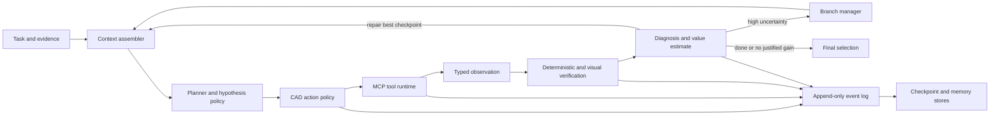
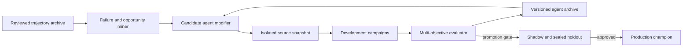

# EvoCAD Agent Architecture Research

Status: design recommendation, 2026-09-01

## Decision

EvoCAD should own a small, model-neutral agent kernel instead of embedding Codex
or adopting a large agent framework as its core abstraction.

The recommended system has three different learning timescales:

1. An online task loop that plans, acts through CAD tools, observes, verifies,
   diagnoses, and decides whether to continue or branch.
2. A trajectory consolidation loop that turns reviewed episodes into retrievable
   cases and versioned procedural skills.
3. An offline evolutionary loop that proposes changes to the agent, evaluates
   them on development campaigns, and promotes only validated versions.

The production agent must never rewrite itself in place. Recursive
self-improvement should operate on isolated candidate versions in an archive.
The campaign verifier, sealed splits, promotion policy, and audit ledger remain
outside the mutation boundary.

## Why This Fits CAD

CAD reconstruction has unusually favorable verification properties. Geometry,
topology, dimensions, native entity types, export validity, and artifact
integrity can often be checked more cheaply and reliably than they can be
generated. This is the asymmetric-verification setting in which verifier-guided
search and evolution are most useful.

CAD also has constraints that make generic multi-agent designs unattractive:

- AutoCAD is a shared, stateful, failure-prone environment.
- Most geometry edits are sequential and dependent, not naturally parallel.
- A plausible image can hide invalid topology or an empty native model.
- The agent can overfit to a visible metric while moving away from design intent.
- Long raw transcripts are less useful than exact artifacts, measurements, and
  checkpoint lineage.

The architecture should therefore treat the CAD environment and verifier as the
source of truth, and treat language-model reasoning as a proposal policy.

## Recommended Runtime Architecture



### 1. Agent kernel

The kernel is a durable state machine, not an LLM conversation loop. It owns:

- run lifecycle and hard safety limits;
- typed action and observation events;
- idempotency keys and tool retry policy;
- checkpoint lineage and best-candidate selection;
- context assembly and model invocation;
- branch creation and pruning;
- budget accounting;
- pause, resume, cancellation, and human review gates.

The kernel should be deterministic given recorded model outputs and tool
observations. This makes every run replayable without rerunning AutoCAD.

### 2. Model gateway

Define EvoCAD-owned canonical request and response types. Provider adapters map
those types to OpenAI, Anthropic, Google, and local inference APIs.

Minimum interface:

```text
ModelProvider.start(request) -> ConversationHandle
ModelProvider.continue(handle, request) -> ModelTurn
ModelProvider.cancel(handle)
ModelProvider.capabilities() -> CapabilitySet
```

`ModelTurn` should contain assistant content, typed tool requests, structured
output, token use, finish reason, provider metadata, and raw-event artifact
locations. Provider thread identifiers are opaque adapter state, not the
EvoCAD session identity.

LiteLLM can be an optional transport adapter because it normalizes many model
providers, but EvoCAD should not use the OpenAI response shape as its domain
model. Tool calling, image input, reasoning controls, continuation, caching,
and structured output differ enough across providers to require explicit
capability negotiation.

### 3. Context assembler

Do not replay the full event stream into every model call. Build context from:

- immutable task goal and input evidence;
- current structured plan and unresolved hypotheses;
- current and best checkpoint summaries;
- latest verifier feedback and failure ownership;
- a short window of recent actions and observations;
- retrieved procedural skills and analogous reviewed episodes;
- remaining budgets and safety constraints.

The append-only event log is the complete memory. The prompt is only a view of
that memory. Compaction should generate a new derived artifact and never replace
source events.

### 4. Planning and execution

Use one logical agent with role-separated model calls rather than a permanent
team of autonomous agents.

- The planner creates a geometry hypothesis set and identifies unknowns.
- The executor performs the next bounded CAD operation or short programmatic
  tool sequence.
- The diagnosis policy interprets verifier evidence, assigns failure ownership,
  estimates value of another attempt, and selects repair, branch, or stop.
- The final selector chooses only among verified checkpoints.

These roles may use the same model or different models. They should have
separate contexts and schemas. The deterministic verifier remains independent.

### 5. Selective branching

Pure sequential repair is cheap but can remain trapped in the wrong structural
hypothesis. Full Language Agent Tree Search or MCTS is too expensive for normal
AutoCAD operations. Use progressive widening at explicit uncertainty points:

- ambiguous view interpretation;
- multiple plausible part configurations;
- Boolean strategy repeatedly failing;
- plateau after a high-confidence local repair;
- verifier evidence inconsistent with the current structural hypothesis.

Create two or three cloned candidate branches, run cheap checks first, and only
fully score promising branches. Branches share immutable history but never a
live AutoCAD document.

### 6. Memory

Use four memory layers with different promotion rules:

1. Event memory: exact actions, observations, artifacts, and model turns.
2. Episodic memory: reviewed summaries keyed by geometry family, failure
   signature, tool behavior, and outcome.
3. Procedural memory: versioned executable or textual skills distilled from
   repeated successful episodes.
4. Semantic memory: stable CAD concepts, tool contracts, and project policy.

Retrieval should combine structured filters with semantic similarity. Raw
nearest-neighbor trajectory retrieval is insufficient because superficially
similar geometry can require different construction strategies.

New procedural skills are candidates, not immediately trusted memory. Promote a
skill only after replay tests and held-out transfer checks. Record negative
transfer and retirement decisions.

## Offline Recursive Self-Improvement

The strongest current pattern for EvoCAD is closer to Darwin Godel Machine and
AlphaEvolve than to unrestricted online self-editing.



### Mutable components

The outer loop may propose changes to:

- prompts and structured decision schemas;
- context selection and compaction policy;
- model routing and budget allocation;
- branch triggers and search policy;
- skill retrieval, distillation, and composition;
- MCP tool descriptions, examples, wrappers, and recovery logic;
- planner, executor, and diagnosis policy code;
- observability and error classification.

### Immutable evaluation constitution

The same candidate must not control both behavior and the evidence used to
promote that behavior. Keep these outside its write boundary:

- campaign manifests and sealed splits;
- ground-truth assets;
- verifier implementation used for the active comparison;
- ledger integrity and artifact hashing;
- candidate sandbox and permission policy;
- promotion statistics and minimum sample requirements;
- human-review records.

An agent may propose verifier changes, but those changes form a separate
verifier candidate and require calibration against human judgments before any
agent comparison uses them.

### Archive, not hill climbing

Do not retain only the current champion. Maintain parent-child lineage and
behavioral diversity. Useful archive axes for EvoCAD include:

- strict completion and continuous geometry score;
- cost and elapsed time;
- robustness to MCP and Core Console failures;
- geometry family coverage;
- construction strategy;
- model-provider transfer;
- number and severity of human-review disputes;
- implementation complexity.

A temporarily worse candidate can contain a tool or memory innovation that
becomes useful in a later descendant. Archive search preserves those stepping
stones and makes source attribution exact.

### Fitness and promotion

Use multi-objective selection. Strict pass rate is primary, but a candidate is
not promotable if it improves that metric by consuming unbounded compute or by
weakening evidence integrity.

Promotion should require:

1. unit and replay tests;
2. repeated development campaigns with paired analysis;
3. no regression on infrastructure and adversarial cases;
4. model-transfer evaluation;
5. shadow pilot evaluation;
6. one sealed holdout evaluation;
7. human approval for production and publication claims.

## What to Adopt From Current Research

### ReAct and CodeAct: adopt as the action substrate

Interleaved reasoning, action, and observation remains the correct base loop.
CodeAct is useful when a short program can compose several read-only or bounded
tool operations without filling context with intermediate results. CAD writes
still need typed, auditable transactions.

### SWE-agent and OpenHands: adopt the interface boundaries

The main lesson is that agent-computer interface design matters as much as the
model. OpenHands' separation of agent, controller, event stream, and sandboxed
runtime closely matches EvoCAD's needs. EvoCAD should reuse the architectural
boundary, not the full software-engineering product.

### Planner-generator-evaluator: adopt selectively

Long-running-agent work supports role separation and structured handoff
artifacts. For CAD, use planner, executor, and diagnosis calls, but avoid several
agents concurrently editing shared geometry. Parallelism belongs at independent
hypothesis branches and batch jobs.

### LATS and test-time search: use only at uncertainty points

Tree search can escape a poor early hypothesis, and diverse parallel rollouts
can outperform longer sequential refinement. AutoCAD makes broad search costly,
so branching should be verifier-triggered and budget-aware rather than the
default for every step.

### Voyager and Agent Workflow Memory: adopt the skill-memory idea

Both show the value of converting successful trajectories into reusable,
retrievable procedures. EvoCAD already records the evidence needed to build a
CAD-specific workflow and skill library. Human review and held-out promotion are
needed to prevent incorrect procedures from compounding.

### ADAS and Self-Improving Coding Agent: use as research baselines

Defining an agent in code gives a meta-agent a broad search space over prompts,
tools, and control flow. A single self-editing lineage is easy to implement, but
it is vulnerable to local optima, regressions, and benchmark overfitting. It is
a useful baseline, not the recommended production evolution strategy.

### Darwin Godel Machine and AlphaEvolve: adopt for the outer loop

The important common structure is candidate generation, automatic evaluation,
and a program archive. DGM adds open-ended lineage exploration; AlphaEvolve adds
model ensembles and evaluator-driven program selection. EvoCAD can apply this
pattern because its agent, MCP wrappers, prompts, and skills are all versioned
code or text and its geometry verifier supplies dense feedback.

### Unrestricted Godel-style online RSI: do not adopt

Allowing the active task agent to rewrite its own runtime, memory rules, tools,
and evaluator creates non-replayable runs and a direct reward-hacking path. It
also destroys the meaning of campaign-level comparison. Self-modification must
produce a new isolated version evaluated outside the task that proposed it.

## Framework Choice

### Recommended now: custom Python kernel on the existing ledger

EvoCAD already has an append-only trajectory ledger, immutable manifests,
checkpoint selection, feedback packets, review bundles, and an MCP boundary.
The shortest path is to extract the Codex-specific invocation from
`geometry_campaign.py` behind provider and conversation interfaces while
preserving the proven loop semantics.

Use SQLite initially for event indexing and queues while artifacts remain in the
workspace. This keeps the first implementation inspectable and evolvable.

### Optional later: Temporal for distributed durability

When campaigns run across multiple machines or must survive worker deployment,
Temporal is a strong outer durability layer. Model calls, AutoCAD jobs, exports,
and verification become idempotent activities; the EvoCAD kernel remains domain
logic. Do not add Temporal before local provider-neutral replay works.

### Alternative: LangGraph

LangGraph provides persistence, checkpoints, human interrupts, and long-running
state graphs. It is reasonable for a prototype, but EvoCAD already owns most of
the needed persistence and needs its agent policy to be easily mutated by the
offline evolution system. A direct kernel gives a smaller mutation surface and
clearer experimental attribution.

## Proposed Package Boundaries

```text
src/cad_evoloop/agent/
  kernel.py            durable state transitions
  events.py            canonical event schemas
  state.py             derived run state
  context.py           context assembly and compaction
  policy.py            planner, action, diagnosis contracts
  branching.py         checkpoint tree and budget policy
  memory.py            episodic and procedural retrieval
  models/
    base.py            provider and conversation protocols
    openai.py
    anthropic.py
    google.py
    litellm.py          optional adapter
  tools/
    broker.py          MCP discovery, authorization, receipts
    autocad.py         CAD-specific typed tool facade
  evolution/
    archive.py         candidate lineage and diversity metadata
    proposer.py        mutation proposals
    evaluator.py       campaign execution and multi-objective fitness
    promotion.py       champion/challenger gates
```

The existing ledger, verifier, review UI, datasets, and AutoCAD MCP server stay
outside this package and are called through interfaces.

## Implementation Sequence

### Phase 0: semantic parity

1. Define canonical model, tool, and event schemas.
2. Implement a provider-neutral conversation interface.
3. Move the v2 online loop from `geometry_campaign.py` into `AgentKernel`.
4. Add a Codex compatibility adapter only to prove parity against recorded v5
   trajectories.
5. Add one direct API provider and replay tests that require no AutoCAD rerun.

Success means the new kernel reproduces stop reasons, checkpoint selection, and
feedback binding from recorded events.

### Phase 1: long-horizon capability

1. Add structured task plans and geometry hypotheses.
2. Add context views and cross-session resume.
3. Add episodic retrieval from reviewed trajectories.
4. Add selective two-to-three-way branch search.
5. Add model routing by role, uncertainty, and remaining budget.

### Phase 2: procedural learning

1. Distill candidate workflows from repeated trajectory clusters.
2. Validate skills through replay and development campaigns.
3. Record transfer, negative transfer, and retirement.
4. Retrieve only promoted skills during fixed campaigns.

### Phase 3: offline RSI

1. Make agent versions immutable source snapshots.
2. Implement a DGM-style archive and parent selection policy.
3. Allow bounded mutation of agent code, prompts, tools, and skills.
4. Evaluate with multi-objective campaign fitness and repeated seeds.
5. Add shadow and sealed-holdout promotion gates.

## Required Ablations

The paper should separate contributions instead of comparing only a monolithic
new agent against Codex:

1. Provider-neutral ReAct kernel without memory or branching.
2. Kernel plus structured planner and diagnosis policy.
3. Kernel plus episodic memory.
4. Kernel plus procedural skill memory.
5. Kernel plus selective branching.
6. Human-designed champion versus hill-climbing self-editing.
7. Human-designed champion versus archive-based open-ended evolution.
8. Same evolved agent transferred across model providers.

Each condition needs repeated runs, paired workflow-level confidence intervals,
cost-normalized success, verifier-error accounting, and blinded human audit.

## Primary Sources

- Anthropic, [Building Effective Agents](https://www.anthropic.com/research/building-effective-agents), 2024.
- Anthropic, [Effective Context Engineering for AI Agents](https://www.anthropic.com/engineering/effective-context-engineering-for-ai-agents), 2025.
- Anthropic, [Effective Harnesses for Long-Running Agents](https://www.anthropic.com/engineering/effective-harnesses-for-long-running-agents), 2025.
- Anthropic, [Harness Design for Long-Running Application Development](https://www.anthropic.com/engineering/harness-design-long-running-apps), 2026.
- Wang et al., [Voyager](https://arxiv.org/abs/2305.16291), 2023.
- Shinn et al., [Reflexion](https://arxiv.org/abs/2303.11366), 2023.
- Zhou et al., [Language Agent Tree Search](https://arxiv.org/abs/2310.04406), 2023.
- Yang et al., [SWE-agent](https://arxiv.org/abs/2405.15793), 2024.
- Wang et al., [Agent Workflow Memory](https://arxiv.org/abs/2409.07429), 2024.
- Wang et al., [Executable Code Actions Elicit Better LLM Agents](https://arxiv.org/abs/2402.01030), 2024.
- Hu et al., [Automated Design of Agentic Systems](https://arxiv.org/abs/2408.08435), 2024.
- Robeyns et al., [A Self-Improving Coding Agent](https://arxiv.org/abs/2504.15228), 2025.
- Zhang et al., [Darwin Godel Machine](https://arxiv.org/abs/2505.22954), 2025.
- Google DeepMind, [AlphaEvolve](https://deepmind.google/blog/alphaevolve-a-gemini-powered-coding-agent-for-designing-advanced-algorithms/), 2025.
- Zhu et al., [Scaling Test-Time Compute for LLM Agents](https://arxiv.org/abs/2506.12928), 2025.
- Pan et al., [Spontaneous Reward Hacking in Iterative Self-Refinement](https://arxiv.org/abs/2407.04549), 2024.
- OpenHands, [Software Agent SDK](https://arxiv.org/abs/2511.03690), 2025.
- LangGraph, [Orchestration Runtime Overview](https://langchain-ai.github.io/langgraph/index.html).
- Temporal, [Durable Execution Documentation](https://docs.temporal.io/).
- Model Context Protocol, [Tool Specification](https://github.com/modelcontextprotocol/modelcontextprotocol/blob/main/docs/specification/2026-07-28/server/tools.mdx), 2026.

