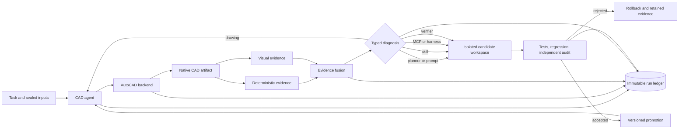

# CAD-EvoLoop: Publication and Scale Blueprint

Status: research architecture decision record, 2026-08-29

## 1. Decision

The feasibility demo is complete. It has demonstrated an end-to-end adaptive
loop on three development tasks: drawing repair, first-pass 3D completion, and
verifier repair with an evidence audit. This is enough to start the research
engineering phase, but not enough to claim scale, generality, or scientific
validity.

Large-scale evaluation starts only after the Phase 1 gates below are met. The
existing 40/10 split remains a development split. It is not the final paper
test set, and no system component may adapt on the ten reserved samples.

## 2. Paper Thesis

Working title:

> Evidence-Grounded Self-Improvement for Agents in Real CAD Environments

The central claim is not that a language model can draw in CAD. Prior work
already covers tool-augmented CAD generation and iterative geometry repair.
The claim to test is:

> A CAD agent can use typed execution and verification evidence to attribute a
> failure to the drawing, planner, tool interface, verifier, or harness; choose
> the corresponding repair; and improve either the artifact or an isolated
> system component under tests, regression checks, versioning, and rollback.

Candidate contributions:

1. A typed, evidence-rich protocol for failure attribution and repair routing
   in a real CAD application.
2. A controlled self-modification mechanism spanning prompts, skills, MCP
   infrastructure, and verifiers without granting unrestricted production
   edits.
3. An append-only trajectory and artifact ledger that makes every score,
   decision, patch, and CAD output auditable and replayable without redrawing.
4. A benchmark protocol for heterogeneous 2D, 3D, mechanical, and architectural
   workflows using deterministic evidence, visual evidence, and expert audits.

Proposed system figure:



## 3. Scientific Metric

Do not use nominal verifier score as the primary metric. A score of 100 with
35.48 percent coverage is not a completed task.

Primary metric: Evidence-Qualified Completion (EQC).

```text
EQC = sum(rubric_weight for independently evidenced passes)
      / sum(all rubric_weight)
```

An unverified, malformed, or infrastructure-failed rubric contributes zero.
Report the following separately:

- EQC and task success at a frozen threshold;
- evidence coverage;
- conditional accuracy on covered rubric weight;
- execution-valid and native-CAD-entity rates;
- recovery rate and attempts to recovery;
- wall time, CAD process time, tokens, and estimated cost;
- AutoCAD/Core Console timeout, crash, and orphan-process rates;
- verifier false-pass and false-fail rates against expert labels;
- failure-owner classification accuracy;
- accepted system patches, rejected patches, and regression escapes.

Use paired bootstrap 95 percent confidence intervals over workflows. For
stochastic model runs, keep the same inputs and configurations across
conditions and report every run, not only the best attempt.

## 4. Experimental Protocol

### Development

- Use the current 40 development samples for implementation and ablations.
- Keep the current ten reserved samples sealed during method development.
- Treat the completed dataset outputs as evaluator-only ground truth. Agents
  receive only the task description and declared input assets.
- Record a manifest containing hashes of every accessible input and every
  evaluator-only artifact.

### Final evaluation

- Freeze prompts, skill, MCP, verifier, schemas, model identifiers, and all
  thresholds before opening a paper test set.
- Draw a new stratified test set from previously unused AutoCAD workflows. The
  dataset currently exposes 238 AutoCAD workflows; the local 50 are a pilot,
  not sufficient support for a broad industrial-generalization claim.
- Stratify by 2D/3D, mechanical/architectural, task length, input modality,
  dimension density, and rubric type.
- Run fixed model/configuration pairs with at least three repeated trials where
  model nondeterminism cannot be fixed.
- Expert-audit all disputed verifier decisions and a random sample of accepted
  decisions. Report annotator instructions and agreement.

### Required baselines and ablations

Baselines:

- single-pass agent;
- artifact-only reflection and repair;
- best-of-N with a fixed verifier;
- full adaptive system.

Ablations:

- no typed diagnostics;
- no failure ownership routing;
- no visual verifier;
- no deterministic verifier;
- no system-component edits;
- prompt-only, skill-only, MCP-only, and verifier-only edits;
- no regression gate or no independent verifier audit;
- no trajectory reuse;
- synchronous desktop AutoCAD versus isolated Core Console execution.

Adversarial checks must include malformed verifier output, missing dependencies,
swapped dimension evidence, plausible text used instead of native dimensions,
stale DWG checkpoints, timeouts, duplicate rubric IDs, and attempts to read
evaluator-only files.

## 5. Target Repository Architecture

```text
CAD-EvoLoop/
  README.md
  LICENSE
  CITATION.cff
  CONTRIBUTING.md
  CODE_OF_CONDUCT.md
  SECURITY.md
  pyproject.toml
  src/agentic_cad/
    agent/                 # model runtime and planning adapters
    supervisor/            # diagnosis, ownership, action policy
    protocol/              # versioned typed messages and JSON schemas
    backends/autocad/      # unrestricted CAD interface and job isolation
    verification/          # deterministic, visual, and evidence fusion
    ledger/                # immutable run, artifact, patch, and lineage data
    evaluation/            # metrics, statistics, and report builders
  skills/autocad-image-modeling/
  configs/
    models/
    campaigns/
    verifiers/
  benchmarks/cad1000/
    README.md              # provenance, license, preparation instructions
    manifests/             # IDs, hashes, categories, and sealed split hashes
    schemas/
    adapters/
  experiments/paper/
    main/
    ablations/
    robustness/
  apps/run-explorer/       # cached trajectory and evidence explorer
  scripts/                 # thin CLI entry points only
  tests/
    unit/
    integration/
    e2e/
    adversarial/
  docs/
    architecture.md
    evaluation.md
    reproducibility.md
    governance.md
  paper/
  artifacts/               # generated, content-addressed, and gitignored
```

Ownership boundaries:

- `backends/autocad` exposes CAD operations and lifecycle control; it does not
  impose geometry policy.
- `verification` observes and scores; it cannot modify drawings.
- `supervisor` chooses a typed action; it does not directly mutate production.
- candidate system edits occur in an isolated workspace and become production
  only through static validation, tests, development regression, independent
  evidence audit, and an explicit promotion record.
- `ledger` is the source of truth for paper results. Figures are generated only
  from immutable ledger snapshots and campaign manifests.

## 6. Artifact and Version Policy

Every run must bind:

- source commit and dirty-tree digest;
- campaign configuration digest;
- dataset/split manifest digest;
- model/provider identifier and inference parameters;
- AutoCAD and Core Console versions;
- prompt, skill, MCP, verifier, and schema hashes;
- input, checkpoint, render, scene, verdict, patch, and final DWG hashes;
- timestamps, durations, retry causes, and parent/child run IDs.

Generated jobs and experiment records must not enter Git. Store them under a
content-addressed artifact root and publish a small paper snapshot plus a script
that validates hashes and regenerates every table and figure.

The dataset card currently does not declare a license. Until explicit terms are
confirmed, do not redistribute downloaded CAD-1000-Hours recordings, inputs, or
outputs in the public repository. Publish IDs, hashes, preparation scripts, and
derived aggregate statistics only.

## 7. Paper Figures

Figure 1, teaser: input image and requirements, generated native CAD result with
evidence overlays, and the compact adaptive trajectory that fixed it.

Figure 2, method: two nested loops. The inner loop repairs the CAD artifact; the
outer loop attributes system failures and proposes versioned component patches.
All arrows terminate in evidence and ledger records.

Figure 3, main result: EQC by task family and method with paired 95 percent
confidence intervals. Show coverage beside success so nominal false passes are
visible.

Figure 4, trajectory anatomy: the mechanical example from one native dimension
to nine, and the architectural verifier path from low coverage through the
swapped-evidence bug to the audited candidate.

Figure 5, attribution and intervention: a flow view from observed failure to
predicted owner, selected action, accepted/rejected patch, and final outcome.

Figure 6, efficiency and reliability: success-versus-CAD-minutes curve, recovery
by attempt, timeout/crash rate, and the effect of Core Console isolation.

Figure 7, ablations: a compact heatmap across task families for typed evidence,
ownership routing, visual verification, regression gates, and trajectory reuse.

Never present a clean final render alone. The paper's visual identity should be
native geometry plus verifiable evidence plus an auditable improvement path.

## 8. Interactive Demo

Build a local-first Run Explorer backed only by cached ledger data. It should:

- filter by task, family, model, method, component version, and outcome;
- replay the event timeline without rerunning AutoCAD;
- compare reference, initial CAD render, repaired render, and evidence overlays;
- inspect every rubric, coverage gap, VLM region, entity-level fact, and hash;
- display prompt/skill/MCP/verifier diffs and the tests that admitted or rejected
  a candidate;
- compare any two runs on score, EQC, coverage, attempts, cost, and source;
- export a paper-ready SVG/PDF figure and a machine-readable evidence bundle;
- optionally resume from a checkpoint as a separate child run.

The flagship story should be a verifier initially giving a misleading nominal
pass, the supervisor diagnosing missing evidence, a candidate verifier exposing
more structure, the audit finding swapped evidence, and a second patch fixing
the evidence binding without touching the protected holdout.

## 9. Release Gates

Phase 1, scale-ready:

- repository initialized and cleanly versioned;
- code separated from datasets and generated artifacts;
- all schemas versioned and validated;
- one-command pilot reproduction on a documented environment;
- license/provenance audit complete;
- leakage and verifier-gaming tests pass;
- 40-sample development campaign completes without manual process cleanup;
- all 68 current tests plus new integration/adversarial tests pass.

Phase 2, paper-ready:

- frozen test manifest opened exactly once;
- baseline, main, ablation, and robustness campaigns complete;
- expert verifier audit and statistical analysis complete;
- every paper number traces to an immutable run query;
- the Run Explorer reproduces all showcase trajectories from cached artifacts;
- anonymous artifact package can be exercised from a fresh machine.

## 10. Immediate Migration Order

1. Finish provenance and license inventory before selecting the repository
   license or publishing dataset-derived files.
2. Introduce `pyproject.toml`, package boundaries, and stable CLI entry points;
   move code incrementally while keeping compatibility wrappers.
3. Move all generated records to a content-addressed artifact root and add
   retention/cleanup commands for Core Console jobs.
4. Define campaign manifests and EQC report generation, then run the complete
   40-sample development campaign.
5. Calibrate and adversarially test the verifier on expert-labeled cases.
6. Freeze the system, create a new untouched paper test set, and run the final
   matrix.
7. Build the Run Explorer against the frozen ledger schema and generate the
   paper figures from the same queries.
